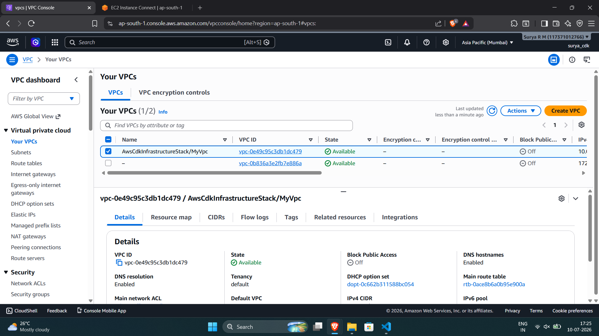
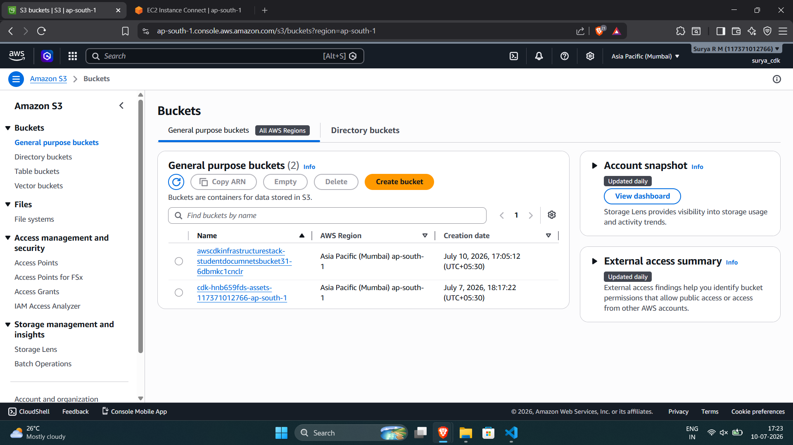
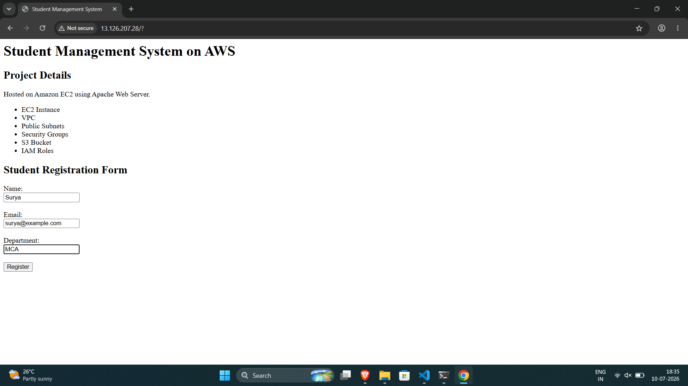

# Author

**Surya R M**

MCA – Storage and Cloud Technology  
Jain University

# AWS CDK Infrastructure Project

This project demonstrates Infrastructure as Code (IaC) using AWS Cloud Development Kit (CDK) and TypeScript.

The infrastructure automatically provisions AWS resources and deploys a simple Student Management web application on Amazon EC2 using Apache Web Server.

---

# AWS Services Used

- Amazon EC2
- Amazon VPC
- Public Subnets
- Internet Gateway
- Route Tables
- Security Groups
- Amazon S3
- IAM Roles
- AWS CloudFormation
- AWS CDK

---

#  Architecture

```text
User
  ↓
Internet
  ↓
Internet Gateway
  ↓
Public Subnet
  ↓
EC2 Instance (Apache Web Server)
  ↓
Student Management Web Application
  ↓
Amazon S3 Bucket
```

---

# Features

✅ Infrastructure as Code using AWS CDK

✅ Automated AWS resource provisioning

✅ Custom VPC with Public Subnets

✅ Security Group configuration

✅ EC2 instance deployment

✅ Apache Web Server installation

✅ Student Management web application hosting

✅ Resource cleanup using `cdk destroy`

---

#  Project Structure

```text
AWS-CDK-Infrastructure
│
├── bin/
├── lib/
├── Screenshots/
├── README.md
├── package.json
├── cdk.json
├── tsconfig.json
└── .gitignore
```

---

#  Deployment Steps

### Install Dependencies

```bash
npm install
```

### Build Project

```bash
npm run build
```

### Bootstrap AWS Environment

```bash
cdk bootstrap
```

### Deploy Infrastructure

```bash
cdk deploy
```

### Destroy Infrastructure

```bash
cdk destroy
```

---

# Screenshots

## EC2 Instance Deployment


## Security Group Configuration


## Custom VPC



## S3 Bucket



## Web Application



---

# Learning Outcomes

- Infrastructure as Code (IaC)
- AWS Networking Concepts
- EC2 Administration
- Linux Server Management
- Cloud Resource Provisioning
- Web Application Deployment on AWS
- Infrastructure Cleanup using CDK

---

